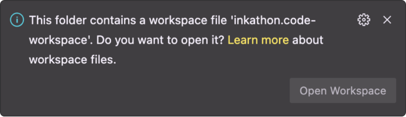

# Prediction Market

[](https://www.gnu.org/licenses/gpl-3.0)
[](https://use.ink)


This is a full-stack dApp forked & developed from [ink!athon Boilerplate](https://github.com/scio-labs/inkathon) built with ink! smart contracts with an integrated frontend using nextjs (TS).

---

**Table of Contents:**

1. [About 📖](#about-)
   1. [1. How It Works](#1-how-it-works)
   2. [2. My Mission](#2-my-mission)
2. [Install Locally 🚀](#install-locally-)
   1. [1. Run the frontend](#1-run-the-frontend)
   2. [2. Build \& deploy contracts on a local node](#2-build--deploy-contracts-on-a-local-node)
   3. [3. Connect the frontend to the local node](#3-connect-the-frontend-to-the-local-node)
   4. [4. Environment Variables](#environment-variables)
3. [VSCode Setup 🛠](#vscode-setup-)
   1. [Workspace](#workspace)
   2. [Plugins](#plugins)

---

## About 📖

Welcome to our cutting-edge Prediction Market DApp, where users engage in exciting event prediction and trading activities in a secure and transparent environment. Our platform empowers users to create and participate in a variety of events, enabling the creation of corresponding markets for users to place their bets.

### 1. How It Works

- Event Creation: Users have the opportunity to create events that intrigue the community, with corresponding markets that enable participants to place bets on different outcomes.

- Fund Creation and Management: Users can create funds and hold shares within these funds. The seamless transfer and trading of shares allow users to actively engage in the market.

- Fund Trading: Each fund is managed by a designated trader holding over 51% of the shares. Users can buy or sell shares within these funds, fostering a dynamic and engaging marketplace.

- Bet on Outcomes: Funds can be utilized to place bets on the outcomes of events. Users have the freedom to contribute to funds and make informed decisions on potential winning outcomes.

- Award Distribution: Upon resolution of an event, the winning outcome is determined, and the respective fund holders are awarded according to their share percentages.

### 2. My Mission

I aim to revolutionize the prediction market experience by offering a secure and user-friendly platform that encourages participation and fosters a community of informed decision-makers. With my emphasis on transparency and fairness, I strive to create an inclusive environment for enthusiasts and traders alike.

Join us in shaping the future of prediction markets and enjoy the thrill of informed speculation with my innovative DApp!

## Install Locally 🚀

### 1. Run the frontend

> **Pre-requisites:**
>
> - Setup Node.js v16+ (recommended via [nvm](https://github.com/nvm-sh/nvm))
> - Install [pnpm](https://pnpm.io/installation) (recommended via [Node.js Corepack](https://nodejs.org/api/corepack.html))
> - Clone this repository

```bash
# Install dependencies (once)
# NOTE: This automatically creates an `.env.local` file
pnpm install

# Start Next.js frontend
pnpm run dev
```

### 2. Build & deploy contracts on a local node

Set `contracts/` as the active working directory in your terminal.

> **Pre-requisites:**
>
> - Install Rust via the [Substrate Docs](https://docs.substrate.io/install/) (skip the "Compile a Substrate node" section)
> - Install [`cargo contract`](https://github.com/paritytech/cargo-contract)
> - Install [`substrate-contracts-node`](https://github.com/paritytech/substrate-contracts-node) in the root

```bash
# Build contracts and move artifacts to `contracts/deployments/{contract}/` folders
pnpm run build

# Start local node with persistence (contracts stay deployed after restart)
# NOTE: When using Brave, shields have to be taken down for the UIs
pnpm run node

## IMPORTANT: Open a separate terminal window and keep the node running

# Deploy the contracts on the local node
pnpm run deploy
```

Alternatively, you can also deploy contracts manually using [Contracts UI](https://contracts-ui.substrate.io/) (`pnpm contracts-ui`) in the browser.

### 3. Connect the frontend to the local node

Open the `frontend/.env.local` file and set the `NEXT_PUBLIC_DEFAULT_CHAIN` variable to `development`. Then restart the frontend and you should be able to interact with the contracts deployed on your local node.

_Read more about environment variables and all available chain constants in the [Environment Variables](#environment-variables) section below._

### Environment Variables

One key element making this boilerplate so flexible is the usage of environment variables to configure the active network in the frontend. This is done by setting the `NEXT_PUBLIC_DEFAULT_CHAIN` variable in the `frontend/.env.local` file, or in the Vercel deployment settings respectively.

<details>
<summary><strong>All Supported Chain Constants</strong></summary>

| Network Identifier  | Name                    | Type    |
| ------------------- | ----------------------- | ------- |
| `development`       | ️Local Development Node | Testnet |
| `alephzero-testnet` | Aleph Zero Testnet      | Testnet |
| `rococo`            | Rococo                  | Testnet |
| `shibuya`           | Shibuya Testnet         | Testnet |
| `shiden`            | Shiden                  | Mainnet |
| `alephzero`         | Aleph Zero              | Mainnet |
| `astar`             | Astar                   | Mainnet |

<small>Source: https://github.com/scio-labs/use-inkathon/blob/main/src/chains.ts</small>

> [!NOTE]  
> Chains can also be supplied manually by creating a [`SubstrateChain`](https://github.com/scio-labs/use-inkathon/blob/main/src/chains.ts#L4) object. If you think a chain is missing, please open an issue or PR.

</details>

All environment variables are imported from `process.env` in [`frontend/src/config/environment.ts`](https://github.com/scio-labs/inkathon/blob/main/frontend/src/config/environment.ts) for type safety.

| Environment Variables           | [Default Values](https://github.com/scio-labs/inkathon/blob/main/frontend/.env.local.example) | Description                                                                                                                                                         |
| ------------------------------- | --------------------------------------------------------------------------------------------- | ------------------------------------------------------------------------------------------------------------------------------------------------------------------- |
| `NEXT_PUBLIC_DEFAULT_CHAIN` \*️⃣ | ️`alephzero-testnet`                                                                          | The network (Substrate-based chain) the frontend should connect to by default and what contract deployment artifacts to import.                                     |
| `NEXT_PUBLIC_PRODUCTION_MODE`   | `false`                                                                                       | Optional boolean flag to differentiate production environment (e.g. for SEO or Analytics).                                                                          |
| `NEXT_PUBLIC_URL`               | `http://localhost:3000`                                                                       | Optional string that defines the base URL of the frontend (will be auto-inferred from Vercel environment variables).                                                |
| `NEXT_PUBLIC_SUPPORTED_CHAINS`  | –                                                                                             | Optional array with network identifers (e.g. `["alephzero-testnet", "shibuya"]`) that are supported by the frontend, **if the dApp is supposed to be multi-chain**. |

<small>\*️⃣ Required </small>

## VSCode Setup 🛠

### Workspace

It's recommended to develop in VSCode by opening the workspace file `inkathon.code-workspace` instead of just the plain directory. This approach offers multiple advantages, including a more predictable monorepo configuration. VSCode will also automatically suggest switching to the workspace when opening the project's root directory in the bottom right corner.



### Plugins

Additionally, the VSCode plugins listed below are recommended as they can be very helpful when working with this boilerplate.

<details>
<summary><strong>All Recommended Plugins</strong></summary>

| Plugin Name                                                                                                                            | Description                                  |
| -------------------------------------------------------------------------------------------------------------------------------------- | -------------------------------------------- |
| [`dbaeumer.vscode-eslint`](https://marketplace.visualstudio.com/items?itemName=dbaeumer.vscode-eslint)                                 | Adds ESLint editor support.                  |
| [`esbenp.prettier-vscode`](https://marketplace.visualstudio.com/items?itemName=esbenp.prettier-vscode)                                 | Adds Prettier editor support.                |
| [`bradlc.vscode-tailwindcss`](https://marketplace.visualstudio.com/items?itemName=bradlc.vscode-tailwindcss)                           | Adds tailwindcss editor support.             |
| [`lightyen.tailwindcss-intellisense-twin`](https://marketplace.visualstudio.com/items?itemName=lightyen.tailwindcss-intellisense-twin) | Adds twin.macro editor support.              |
| [`rust-lang.rust-analyzer`](https://marketplace.visualstudio.com/items?itemName=rust-lang.rust-analyzer)                               | Adds Rust language support.                  |
| [`ink-analyzer.ink-analyzer`](https://marketplace.visualstudio.com/items?itemName=ink-analyzer.ink-analyzer)                           | Adds ink! language support.                  |
| [`tamasfe.even-better-toml`](https://marketplace.visualstudio.com/items?itemName=tamasfe.even-better-toml)                             | Adds `.toml` file support.                   |
| [`gruntfuggly.todo-tree`](https://marketplace.visualstudio.com/items?itemName=gruntfuggly.todo-tree)                                   | Lists all `TODO` comments in your workspace. |
| [`wayou.vscode-todo-highlight`](https://marketplace.visualstudio.com/items?itemName=wayou.vscode-todo-highlight)                       | Lists all `TODO` comments in your workspace. |
| [`mikestead.dotenv`](https://marketplace.visualstudio.com/items?itemName=mikestead.dotenv)                                             | Adds syntax highlighting for `.env` files.   |

</details>
